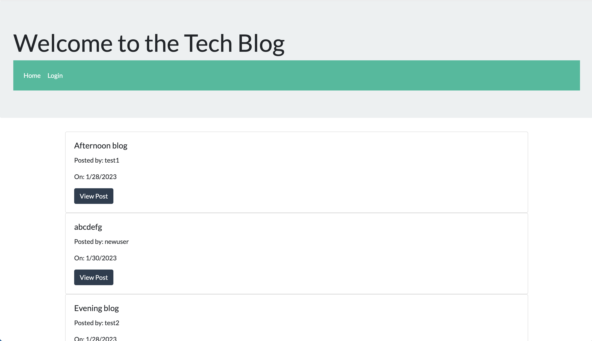

# Tech-Blog

## Description

The Tech-Blog is an application where anyone can write blog entries on tech-related topics. It is a resource for others in the tech industry to share their ideas, thoughts, opinion on the latest technology trends or news.

[Link To Repo](https://github.com/asreedy82/tech-blog)

## Installation

Visit the link below. You can view article headlines without loggin in, but must create an account to view full blog posts. You also need an account to create blogs or comment on other blog entries.

[Link To Site](https://fathomless-lake-63055.herokuapp.com/)

## Usage

The application is designed to help those in the tech industry share what's on their mind. The comment section creates a social environment to open up discussion on these topics.

## Credits

N/A

## License

N/A

### Author: Anthony Reedy